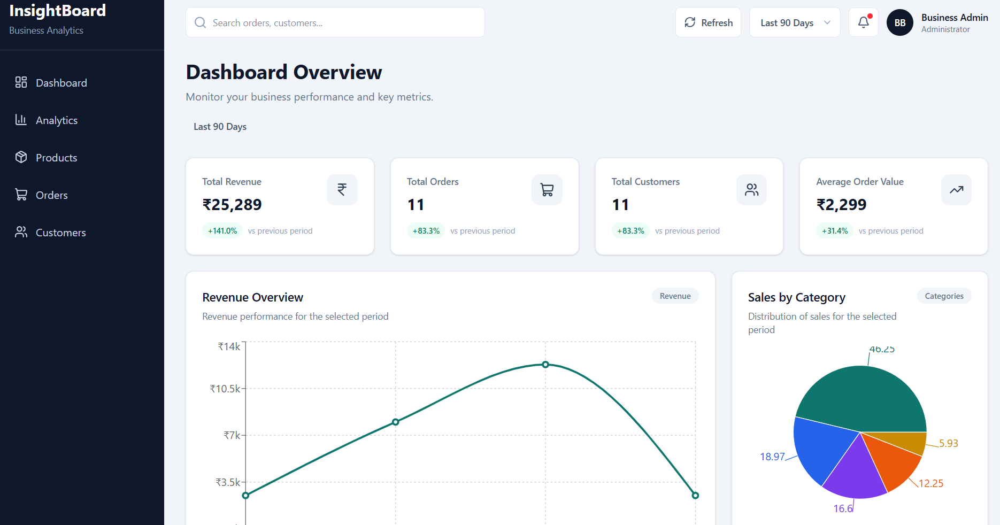
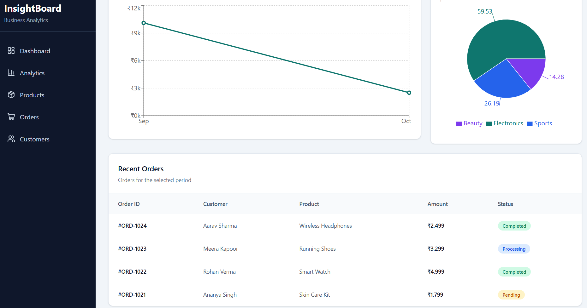
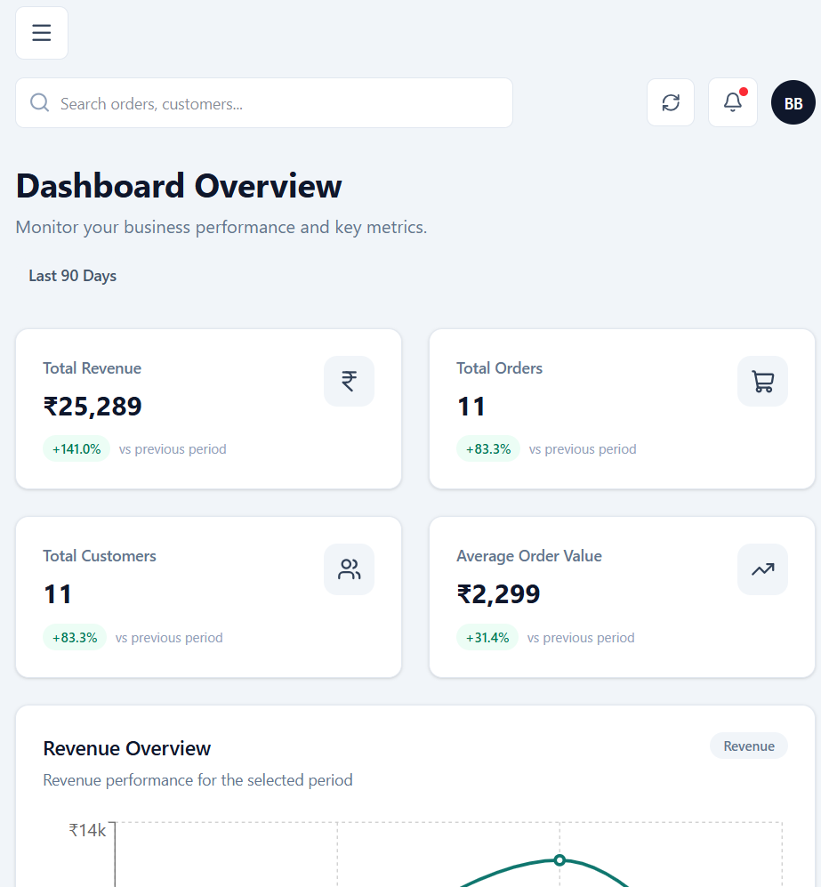

# InsightBoard

## 🚀 Live Demo

**Live Dashboard:** https://insightboard-frontend-gmtt.onrender.com

**Backend API:** https://insightboard-api-lcdm.onrender.com

InsightBoard is a full-stack business analytics dashboard built to visualize sales performance, revenue trends, category distribution, and recent customer orders.

The project demonstrates how a modern React frontend can consume REST APIs backed by Node.js, Express, MongoDB, and Mongoose to provide interactive, data-driven business insights.


## Features

- 📊 Business performance dashboard
- 💰 Total revenue and average order value tracking
- 🛒 Order and customer statistics
- 📈 Revenue trend visualization
- 🥧 Sales distribution by category
- 🔍 Search orders by ID, customer, product, or status
- 📅 Dynamic date-range filtering
  - Last 7 Days
  - Last 30 Days
  - Last 90 Days
  - This Year
- 🔄 Refresh dashboard data without reloading the page
- 📋 Filtered recent orders table
- ⚡ Loading, error, and empty states
- 📱 Responsive dashboard layout
- 🗄️ MongoDB-backed analytics using aggregation pipelines

## Tech Stack

### Frontend

- React
- Vite
- Tailwind CSS
- Recharts
- Lucide React
- JavaScript

### Backend

- Node.js
- Express.js
- REST API
- CORS
- dotenv

### Database

- MongoDB
- Mongoose
- MongoDB aggregation pipelines

## Dashboard

InsightBoard provides a centralized view of business performance through interactive analytics.

### Dashboard Overview



### Analytics & Orders



### Responsive Design



## Architecture

```text
React Frontend
      │
      │ HTTP Requests
      ▼
Express REST API
      │
      │ Mongoose
      ▼
MongoDB
      │
      ▼
Aggregation & Filtering
      │
      ▼
Dashboard Analytics

